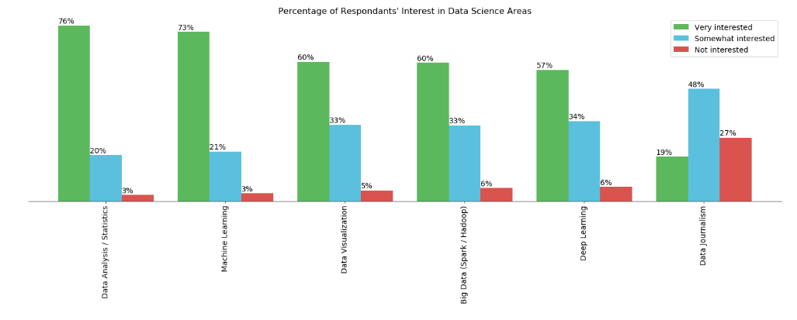
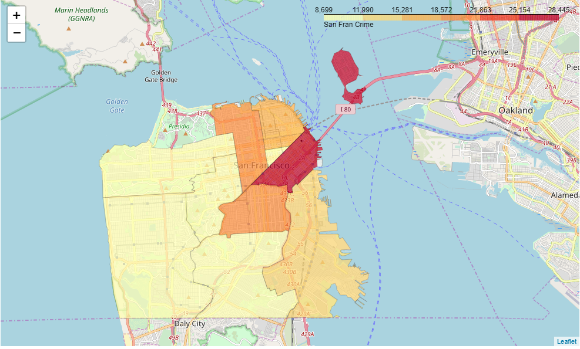

# Folio and Matplotlib in Python
This jupyter notebook shows how to create:

a) A bar chart with percentage labels, and legend using matplotlib.

b) A map of San Fransico showing the crime rate per neighborhood using the Folium library.

